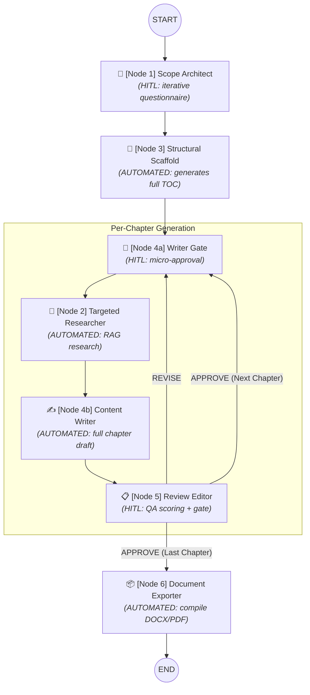

# 📚 Multi-Agent Textbook Creation System

A production-grade **LangGraph** pipeline that builds complete academic textbooks from a structured questionnaire through to a formatted DOCX or PDF file.

## 🌟 Overview

This system orchestrates a 6-node agentic workflow to automate the research, drafting, and formatting of educational materials. It features Human-In-The-Loop (HITL) checkpoints to ensure high quality and alignment with the user's pedagogical goals, without demanding excessive manual effort.

## 🏗️ Architecture



### Interaction Model

| Node | User Effort | Interrupts |
|------|-------------|------------|
| Node 1 · Scope Architect | **High — once** | 1 + N questionnaire questions + 1 export choice |
| Node 3 · Structural Scaffold | None | — |
| Node 4a · Writer Gate | **Ultra-low per chapter** | 1 style selection |
| Node 2 · Targeted Researcher | None | — |
| Node 4b · Content Writer | None | — |
| Node 5 · Review Editor | **Ultra-low per chapter** | 1 decision + optional 1 feedback |
| Node 6 · Document Exporter | None | — |

## 🚀 Setup & Installation

### Prerequisites
- **Python 3.11+**
- Appropriate API Keys depending on the configured model (e.g., Google Gemini, Groq, Anthropic).

### 1. Clone & Install
```bash
git clone https://github.com/your-username/textbook-agent.git
cd textbook-agent
python -m venv .venv
# On Windows
.venv\Scripts\activate
# On macOS/Linux
source .venv/bin/activate

pip install -r requirements.txt
```

### 2. Run the System
```bash
python main.py
```

## 📁 File Structure

```text
textbook-agent/
├── requirements.txt    — Python dependencies
├── state.py            — LangGraph TypedDict state schema
├── nodes.py            — All six agent node implementations + export helpers
├── graph.py            — Graph assembly, routing, build_graph()
├── main.py             — CLI runner (interrupt/resume loop + rich UI)
├── test_graph.py       — Graph functionality tests
├── state.db            — SQLite Checkpointer persistence database
├── output/             — Generated textbooks saved here
├── context.md          — Internal agent context reference
└── README.md           — This file
```

## 🔧 Extending the System

| Goal | Where to change |
|------|----------------|
| **Add a real RAG vector store** | `targeted_researcher` in `nodes.py` |
| **Add web search to research** | Add a tool call inside `targeted_researcher` |
| **Change LLM model** | `MODEL` constant at top of `nodes.py` |
| **Add export formats (ePub)** | Add `_export_epub()` in `nodes.py`, update `doc_exporter` |
| **Persist sessions across restarts**| We are already using `SqliteSaver` in `graph.py`. Modify its config if you need PostgreSQL. |
| **Add a web UI** | Replace `main.py` with a FastAPI + SSE endpoint |

## 🧠 Key Design Decisions

1. **Separation of Concerns (Gate vs. Draft):** Node 4 is split into `writer_gate` (HITL interrupt) and `writer_draft` (automated) so each is independently checkpointed. A failed draft generation does not require re-asking the user.
2. **First-Class Researcher:** The researcher is implemented as a first-class graph node to benefit from LangGraph's checkpointing and retry logic.
3. **`operator.add` Reducer:** Approved chapters append to the master list automatically (`Annotated[List[str], operator.add]`), avoiding custom merge logic.
4. **Idempotency via `temperature=0`:** Setting `temperature=0` for the questionnaire LLM call ensures the same output across LangGraph re-runs upon interrupts.
5. **Deduplication:** `targeted_researcher` skips API calls if a cache entry exists for the chapter.
6. **SQLite Checkpointer:** Leveraging `SqliteSaver` inside `graph.py` to continuously save graph state, allowing pausing and resuming sessions efficiently even after process restarts.

## 📝 Example Session Flow

```
╔══════════════════════════════════════════════╗
║   MULTI-AGENT TEXTBOOK CREATION SYSTEM       ║
╚══════════════════════════════════════════════╝

> Biology for Grade 10

✅  Scope identified: [Biology] for [Grade 10]
📋  I will ask you 10 targeted questions.

━━━ Question 1 / 10 ━━━━━━━━━━━━━━━━━
  Which pedagogical approach best fits your classroom?
  [A]  Inquiry-based  →  Students explore concepts through questions
  [B]  Direct Instruction  →  Structured, teacher-led explanations
> A

📐  Structural Scaffold — 12 chapters generated

🚦  Writer Gate | Ch 1 of 12
  [A]  Narrative / Storytelling
  [B]  Academic / Socratic
> A

🔬  Targeted Researcher — research cache updated
✍️   Content Writer — draft complete (8,432 chars)

📋  QA Review Editor | Ch 1 of 12
  Reading Level:   Grade 9.8  ✓
  Structure:       PASS
  AI Recommendation: APPROVE

  [APPROVE] / [REVISE]:
> APPROVE

... (repeats for each chapter)

📦  Document Exporter
✅  Textbook compiled successfully!
📄  Saved to: output/textbook_biology_20250628_143022.docx
```
