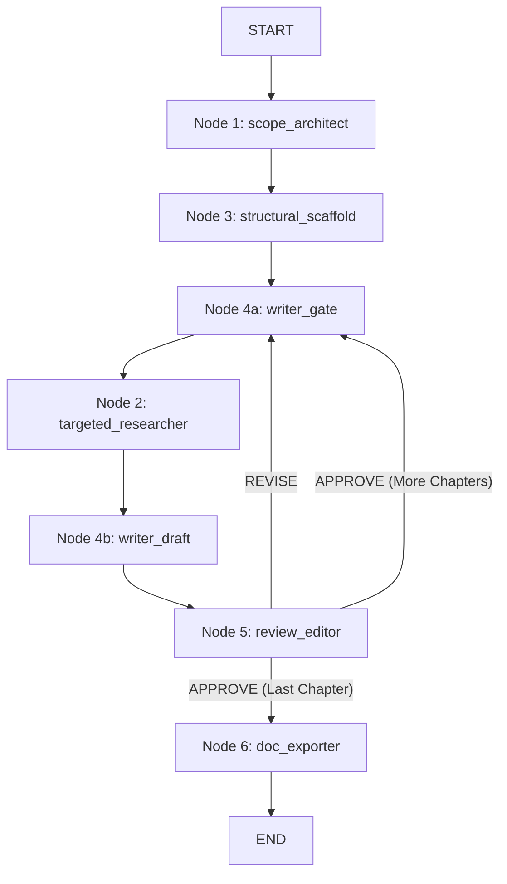

# Textbook Agent Context

## Overview
A production-grade LangGraph pipeline that builds complete academic textbooks from a structured questionnaire through to a formatted DOCX or PDF file.

## Architecture & Flow

## Nodes
1. **Scope Architect (Node 1):** Iterative questionnaire (HITL) to identify subject, grade level, style, etc. Populates Phase 1 metadata.
2. **Structural Scaffold (Node 3):** Automated generation of the full Table of Contents (TOC). Populates Phase 2 blueprint.
3. **Writer Gate (Node 4a):** HITL micro-approval for style and activity selection.
4. **Targeted Researcher (Node 2):** Automated RAG research per chapter. Caches results to avoid redundant API calls.
5. **Content Writer (Node 4b):** Automated full chapter generation based on research and style.
6. **Review Editor (Node 5):** HITL QA scoring + APPROVE / REVISE gate.
7. **Document Exporter (Node 6):** Automated DOCX/PDF compilation.

## Global State Schema (TextbookSystemState)
- **Phase 1 Metadata:** subject, grade_level, target_reading_age, pedagogical_style, compliance_standards, scope_profile
- **Phase 2 Blueprint:** table_of_contents, total_chapters
- **Iteration Control:** current_chapter_index, current_step
- **Manuscript Accumulator:** approved_chapters (uses operator.add)
- **Active Working State:** active_chapter_draft, user_feedback_buffer, selected_activity_type, research_cache
- **Export:** export_format, export_path

## Key Design Decisions
- Node 4 is split into Gate (HITL) and Draft (Automated) for isolated checkpointing.
- Node 2 is a first-class node for checkpointing and retry capabilities.
- Approved chapters use `operator.add` reducer to append to a list instead of overwriting.
- Checkpointer (SqliteSaver is used in `graph.py`) allows pause/resume and state replay.
- `state.db` SQLite database is used for the checkpointer persistence.

## Core Technologies
- LangGraph (Agent Orchestration)
- Google GenAI (Gemini) / Groq / Anthropic / Torch / Accelerate
- rich (CLI UI)
- python-docx, reportlab (Document Export)
